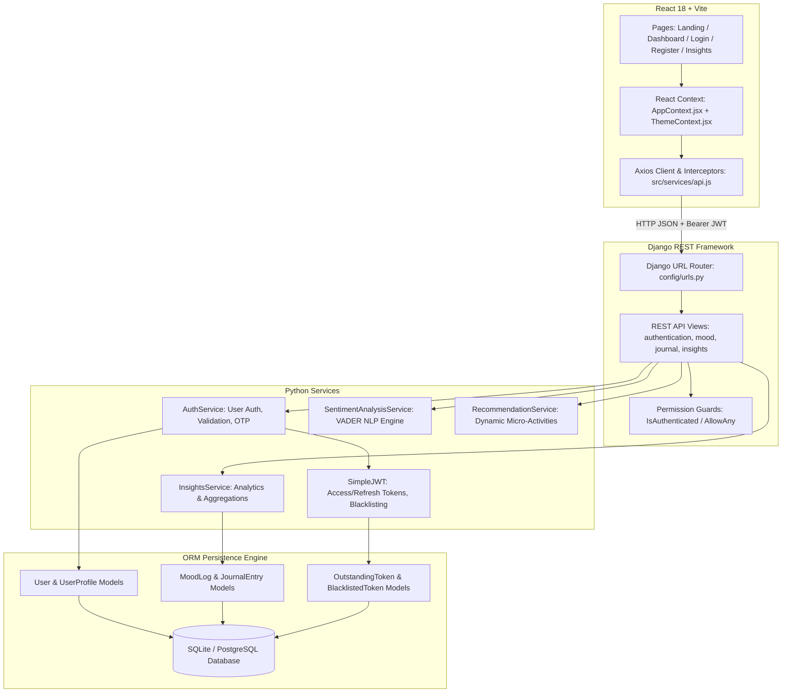
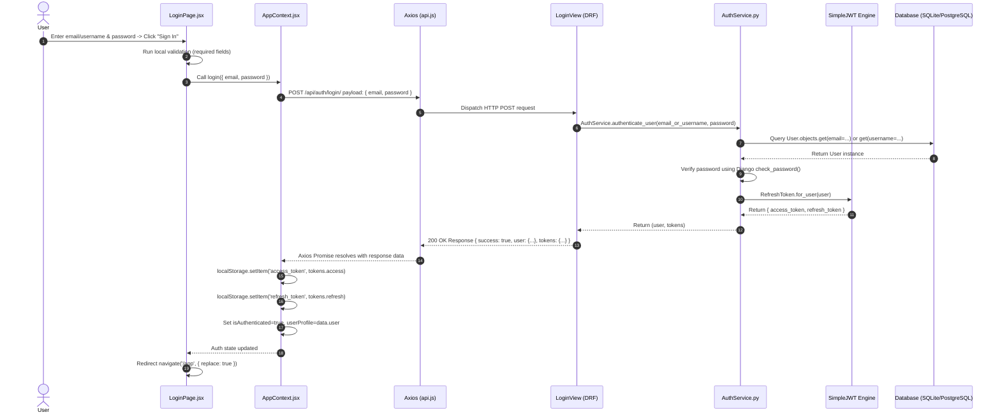
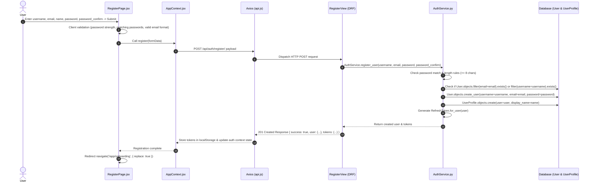
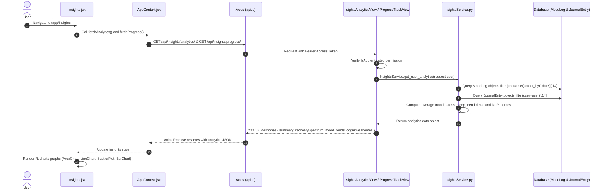
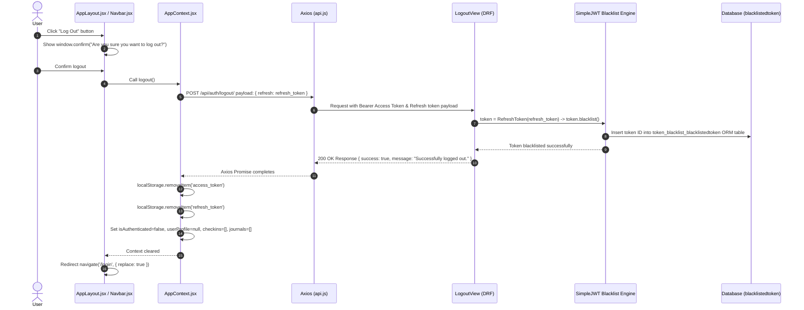

# MindCompass AI - Full End-to-End Technical Architecture & Page-Wise Documentation

This document provides a comprehensive, production-grade technical breakdown of **MindCompass AI**, detailing every layer of execution from the Frontend React components down to the Backend Django REST Framework (DRF) views, service business logic, simpleJWT security engine, and database ORM models.

It covers the following 5 core pages and execution flows in exhaustive detail:
1. **Home Page (`/` Landing Page & `/app` Workspace Dashboard)**
2. **Login Page (`/login`)**
3. **Signup / Register Page (`/register`)**
4. **Insight Page (`/app/insights`)**
5. **Logout Button & Session Teardown Flow**

---

## 1. System Architecture Overview



---

## 2. Home Page (`/` Landing Page & `/app` Workspace Dashboard)

### A. Feature Overview
The Home experience is split into two distinct view states:
1. **Public Landing Page (`/`)**: High-converting, interactive marketing portal introducing MindCompass AI features, live share popup, guest navigation, and CTAs.
2. **Workspace Dashboard (`/app`)**: Protected central dashboard for authenticated users, presenting real-time wellness scores, daily check-in streaks, AI recommendations, recent journal logs, and mood prediction cards.

---

### B. Public Landing Page (`/`) Breakdown

#### 1. Frontend Components & Files
- **File**: [`Frontend/src/pages/LandingPage.jsx`](file:///b:/Work/Coding%20Projects/Web%20Projects/Mind-Compass-AI/Frontend/src/pages/LandingPage.jsx)
  - **Component**: `LandingPage`
  - **Role**: Renders hero illustrations, platform feature grid, 4-step onboarding preview, customer testimonials, and interactive FAQ accordion.
  - **Functions/Hooks**:
    - `useNavigate()`, `useLocation()`: Detects URL hash anchors (e.g., `#features`, `#about`) and triggers smooth scrolling using `elem.scrollIntoView({ behavior: 'smooth' })`.
    - `useEffect()`: Automatically redirects authenticated users possessing a valid token to `/app`.
- **File**: [`Frontend/src/App.jsx`](file:///b:/Work/Coding%20Projects/Web%20Projects/Mind-Compass-AI/Frontend/src/App.jsx#L54-L64)
  - **Component**: `Layout`
  - **Role**: Standard public page shell wrapping `Navbar.jsx`, `<Outlet />`, and `Footer.jsx`.
- **File**: [`Frontend/src/components/Footer.jsx`](file:///b:/Work/Coding%20Projects/Web%20Projects/Mind-Compass-AI/Frontend/src/components/Footer.jsx)
  - **Component**: `Footer`
  - **Role**: Displays footer branding, copyright notice, legal disclaimer, GitHub repository link ([Jatan06/Mind-Compass-AI](https://github.com/Jatan06/Mind-Compass-AI)), and triggers the `ShareModal`.
- **File**: [`Frontend/src/components/ShareModal.jsx`](file:///b:/Work/Coding%20Projects/Web%20Projects/Mind-Compass-AI/Frontend/src/components/ShareModal.jsx)
  - **Component**: `ShareModal`
  - **Role**: Interactive pop-up dialog offering direct sharing to WhatsApp, Twitter/X, LinkedIn, Facebook, Email, native mobile web share, and a 1-click "Copy Link" field pointing to `https://mind-compass-ai-frontend.onrender.com/`.

---

### C. Workspace Dashboard (`/app`) Breakdown

#### 1. Frontend Components & Files
- **File**: [`Frontend/src/pages/Dashboard.jsx`](file:///b:/Work/Coding%20Projects/Web%20Projects/Mind-Compass-AI/Frontend/src/pages/Dashboard.jsx)
  - **Component**: `Dashboard`
  - **Role**: Renders user profile greeting, streak counter, wellness score pill, "Log Today's Mood" CTA, daily check-in status card, AI recommendation banner, mood prediction card, and quick journal entry feed.
- **File**: [`Frontend/src/layouts/AppLayout.jsx`](file:///b:/Work/Coding%20Projects/Web%20Projects/Mind-Compass-AI/Frontend/src/layouts/AppLayout.jsx)
  - **Component**: `AppLayout`
  - **Role**: Authenticated layout shell (`h-screen w-full overflow-hidden`). Renders desktop sidebar (`w-64`), glassmorphic mobile top/bottom bars, route guards, and inner `<main className="overflow-y-auto">` viewport.
- **File**: [`Frontend/src/context/AppContext.jsx`](file:///b:/Work/Coding%20Projects/Web%20Projects/Mind-Compass-AI/Frontend/src/context/AppContext.jsx#L98-L130)
  - **Function**: `refreshDashboardData()`
  - **Role**: Concurrent hydration handler using `Promise.allSettled()` to fetch user profile, check-ins, journal entries, wellness score, and mood predictions without cascading network blockages:
    ```javascript
    const results = await Promise.allSettled([
        fetchUserProfile(),
        fetchCheckIns(),
        fetchJournals(),
        fetchWellnessScore(),
        fetchPrediction()
    ]);
    ```

#### 2. Axios API Integration
- **File**: [`Frontend/src/services/api.js`](file:///b:/Work/Coding%20Projects/Web%20Projects/Mind-Compass-AI/Frontend/src/services/api.js)
  - **Endpoints**:
    - `GET /api/auth/profile/` -> `authAPI.getProfile()`
    - `GET /api/mood/checkin/` -> `moodAPI.getCheckIns()`
    - `GET /api/mood/predict/` -> `moodAPI.getPrediction()`
    - `GET /api/journal/` -> `journalAPI.getJournals()`

#### 3. Backend Views & Controller Logic
- **File**: `authentication/views.py` -> `UserProfileView.get()`
  - **Permission**: `[IsAuthenticated]`
  - **Returns**: User profile details (`id`, `username`, `email`, `name`, `streak`, `onboarding_completed`, `wellness_score`).
- **File**: `mood/views.py` -> `MoodCheckInView.get()`
  - **Permission**: `[IsAuthenticated]`
  - **Query**: `MoodLog.objects.filter(user=request.user).order_by('-date')`
- **File**: `mood/views.py` -> `MoodPredictionView.get()`
  - **Service**: Calls `MoodPredictionService.predict_next_mood(request.user)` to calculate next-day sentiment forecasts based on moving averages of past logs.

#### 4. Database Models & Schema
- **`User`** (`auth_user`): `id`, `username`, `email`, `password`, `is_active`, `date_joined`.
- **`UserProfile`** (`users_userprofile`): `user_id` (OneToOne), `display_name`, `avatar`, `streak_count`, `onboarding_completed`, `wellness_score`.
- **`MoodLog`** (`mood_moodlog`): `id`, `user_id`, `date`, `mood` (1-5), `stress` (1-10), `sleep` (hours), `energy` (1-10), `notes`.
- **`JournalEntry`** (`journal_journalentry`): `id`, `user_id`, `title`, `content`, `cleaned_text`, `analysis` (JSONField), `created_at`.

---

## 3. Login Page (`/login`)

### A. Feature Overview
Allows registered users to authenticate securely using email/username and password or via Google OAuth2. Generates SimpleJWT token pairs (`access` and `refresh`), stores them in `localStorage`, and sets up Axios authorization headers.

---

### B. End-to-End Execution Flow



---

### C. Detailed File & Function Specifications

#### 1. Frontend Layer
- **File**: [`Frontend/src/pages/LoginPage.jsx`](file:///b:/Work/Coding%20Projects/Web%20Projects/Mind-Compass-AI/Frontend/src/pages/LoginPage.jsx)
  - **Component**: `LoginPage`
  - **Form Handlers**:
    - `handleSubmit(e)`: Prevents browser default form submission, validates non-empty inputs, invokes `login(formData)`, and handles field errors.
    - `handleGoogleSuccess(credentialResponse)`: Decodes Google ID token credential and calls `googleLogin(credentialResponse.credential)`.
- **File**: [`Frontend/src/context/AppContext.jsx`](file:///b:/Work/Coding%20Projects/Web%20Projects/Mind-Compass-AI/Frontend/src/context/AppContext.jsx#L170-L195)
  - **Function**: `login(credentials)`
  - **Logic**:
    ```javascript
    const login = async (credentials) => {
        setAuthLoading(true);
        try {
            const response = await authAPI.login(credentials);
            const { tokens, user } = response.data;
            localStorage.setItem('access_token', tokens.access);
            localStorage.setItem('refresh_token', tokens.refresh);
            setIsAuthenticated(true);
            setUserProfile(user);
            await refreshDashboardData();
            return { success: true };
        } catch (err) {
            return { success: false, message: err.response?.data?.message || 'Login failed' };
        } finally {
            setAuthLoading(false);
        }
    };
    ```
- **File**: [`Frontend/src/services/api.js`](file:///b:/Work/Coding%20Projects/Web%20Projects/Mind-Compass-AI/Frontend/src/services/api.js#L20-L45)
  - **Interceptor**: `api.interceptors.request.use((config) => ...)` attached `Authorization: Bearer <access_token>` header to all subsequent outbound HTTP requests.

#### 2. Backend Gateway & Service Layer
- **File**: `authentication/urls.py` -> `path('login/', LoginView.as_view(), name='login')`
- **File**: `authentication/views.py` -> `LoginView.post(request)`
  - **Permission**: `[AllowAny]`
  - **Payload**: `{ "email": "user@example.com", "password": "SecretPassword123" }`
  - **Controller Code**:
    ```python
    class LoginView(APIView):
        permission_classes = [AllowAny]

        def post(self, request):
            email_or_username = request.data.get('email') or request.data.get('username')
            password = request.data.get('password')
            user, tokens = AuthService.authenticate_user(email_or_username, password)
            serializer = UserSerializer(user)
            return Response({
                "success": True,
                "message": "Login successful.",
                "user": serializer.data,
                "tokens": tokens
            }, status=status.HTTP_200_OK)
    ```
- **File**: `authentication/services.py` -> `AuthService.authenticate_user(email_or_username, password)`
  - **Logic**:
    1. Looks up `User` by `email` or `username`.
    2. Runs `user.check_password(password)` against PBKDF2 password hash.
    3. Verifies `user.is_active is True`.
    4. Generates SimpleJWT token pair via `RefreshToken.for_user(user)`.
    5. Returns `(user, { "access": str(refresh.access_token), "refresh": str(refresh) })`.

---

## 4. Signup / Register Page (`/register`)

### A. Feature Overview
Allows new visitors to create a secure account with username, email, display name, and password. Upon successful registration, the backend creates the `User` and `UserProfile` ORM instances, generates JWT tokens, and auto-logs the user in.

---

### B. End-to-End Execution Flow



---

### C. Detailed File & Function Specifications

#### 1. Frontend Layer
- **File**: [`Frontend/src/pages/RegisterPage.jsx`](file:///b:/Work/Coding%20Projects/Web%20Projects/Mind-Compass-AI/Frontend/src/pages/RegisterPage.jsx)
  - **Component**: `RegisterPage`
  - **Functions**:
    - `handleSubmit(e)`: Validates password length (`>= 8`), checks password confirmation equality (`password === password_confirm`), and dispatches `register()`.
    - `calculatePasswordStrength(password)`: Dynamic score indicator evaluating length, numbers, uppercase letters, and special symbols.
- **File**: [`Frontend/src/context/AppContext.jsx`](file:///b:/Work/Coding%20Projects/Web%20Projects/Mind-Compass-AI/Frontend/src/context/AppContext.jsx#L145-L168)
  - **Function**: `register(userData)`
  - **Logic**: Stores received access/refresh tokens in `localStorage`, sets `isAuthenticated = true`, and navigates user to onboarding assessment `/app/onboarding`.

#### 2. Backend Gateway & Service Layer
- **File**: `authentication/urls.py` -> `path('register/', RegisterView.as_view(), name='register')`
- **File**: `authentication/views.py` -> `RegisterView.post(request)`
  - **Permission**: `[AllowAny]`
  - **Request Body**:
    ```json
    {
      "username": "jatan06",
      "email": "jatan@example.com",
      "password": "SecurePassword123!",
      "password_confirm": "SecurePassword123!"
    }
    ```
- **File**: `authentication/services.py` -> `AuthService.register_user(...)`
  - **Logic**:
    1. Validates `password == password_confirm`.
    2. Enforces non-duplicate email/username constraints, raising DRF `ValidationError` if already registered.
    3. Calls `User.objects.create_user()` which hashes raw password using Django's `make_password()` (PBKDF2 SHA256).
    4. Automatically initializes linked `UserProfile` model with default parameters (`streak_count = 0`, `onboarding_completed = False`).
    5. Returns newly created `User` model instance and JWT tokens.

---

## 5. Insight Page (`/app/insights`)

### A. Feature Overview
The Insights dashboard `/app/insights` provides users with deep emotional analytics, historical trend tracking, sleep vs. mood correlations, cognitive theme breakdowns, and AI-driven stability scores over 7-day, 14-day, and 30-day timeframes.

---

### B. End-to-End Execution Flow



---

### C. Detailed File & Function Specifications

#### 1. Frontend Layer
- **File**: [`Frontend/src/pages/Insights.jsx`](file:///b:/Work/Coding%20Projects/Web%20Projects/Mind-Compass-AI/Frontend/src/pages/Insights.jsx)
  - **Component**: `Insights`
  - **Visual Elements**:
    - **Header**: Summary cards for Average Mood, Stress Index, Sleep Quality, and Stability Trend.
    - **Recovery Spectrum Banner**: Dynamic AI statement summarizing emotional progress over the past 14 days.
    - **Interactive Charts (Recharts)**:
      - `AreaChart`: Mood vs. Stress daily progression over selected timeframe (7D/14D/30D).
      - `ScatterPlot`: Correlation analysis comparing hours of sleep vs. mood ratings.
      - `BarChart`: Frequency breakdown of top cognitive themes derived from journal entries.
- **File**: [`Frontend/src/services/api.js`](file:///b:/Work/Coding%20Projects/Web%20Projects/Mind-Compass-AI/Frontend/src/services/api.js#L80-L95)
  - `insightsAPI.getAnalytics()` -> `GET /api/insights/analytics/`
  - `insightsAPI.getProgress()` -> `GET /api/insights/progress/`

#### 2. Backend Gateway & Service Analytics Engine
- **File**: `insights/urls.py`
  - `path('analytics/', InsightsAnalyticsView.as_view(), name='insights-analytics')`
  - `path('progress/', ProgressTrackView.as_view(), name='insights-progress')`
- **File**: `insights/views.py` -> `InsightsAnalyticsView.get(request)`
  - **Permission**: `[IsAuthenticated]`
- **File**: `insights/services.py` -> `InsightsService.get_user_analytics(user)`
  - **Statistical Calculations**:
    1. **Averages**: Computes `avg_mood`, `avg_stress`, `avg_sleep` using Django ORM aggregation `MoodLog.objects.filter(user=user).aggregate(Avg('mood'))`.
    2. **Stability Delta Trend**: Splits 14 most recent mood logs into two halves (`recent_set` vs `older_set`), calculates `delta = recent_avg - older_avg`, and evaluates stability category:
       - `delta > 0.5`: `"Improving Stability"`
       - `delta >= -0.1`: `"Stable"`
       - `delta > -0.6`: `"Slight Decline"`
       - `else`: `"Significant Decline"`
    3. **Recovery Spectrum Evidence Statement**: Compares stress levels across 14-day intervals to calculate stress reduction percentages:
       ```python
       reduction_pct = int(((older_stress - recent_stress) / older_stress) * 100)
       if reduction_pct >= 5:
           recovery_statement = f"Your stress has reduced by {reduction_pct}% over the last two weeks."
       ```
    4. **Cognitive Theme Aggregation**: Extracts keyword themes from `JournalEntry.analysis` JSON fields to construct frequency distributions.

---

## 6. Logout Button & Session Teardown Flow

### A. Feature Overview
The Logout mechanism securely invalidates the user's active session across both client and server layers. It revokes the SimpleJWT refresh token on the backend server, purges tokens from browser `localStorage`, resets React context state, and redirects the user to `/login`.

---

### B. End-to-End Execution Flow



---

### C. Detailed File & Function Specifications

#### 1. Frontend Layer
- **File**: [`Frontend/src/layouts/AppLayout.jsx`](file:///b:/Work/Coding%20Projects/Web%20Projects/Mind-Compass-AI/Frontend/src/layouts/AppLayout.jsx#L94-L99)
  - **Function**: `handleLogout()`
  - **Trigger**: Sidebar Logout button or Mobile Header Logout icon button.
  - **Code**:
    ```javascript
    const handleLogout = async () => {
        if (confirm('Are you sure you want to log out?')) {
            await logout();
            navigate('/login', { replace: true });
        }
    };
    ```
- **File**: [`Frontend/src/context/AppContext.jsx`](file:///b:/Work/Coding%20Projects/Web%20Projects/Mind-Compass-AI/Frontend/src/context/AppContext.jsx#L197-L215)
  - **Function**: `logout()`
  - **Teardown Logic**:
    ```javascript
    const logout = async () => {
        const refresh = localStorage.getItem('refresh_token');
        if (refresh) {
            try {
                await authAPI.logout({ refresh });
            } catch (err) {
                console.error('Logout error on server:', err);
            }
        }
        localStorage.removeItem('access_token');
        localStorage.removeItem('refresh_token');
        setIsAuthenticated(false);
        setUserProfile(null);
        setCheckins([]);
        setJournals([]);
    };
    ```

#### 2. Backend Gateway & Security Teardown
- **File**: `authentication/urls.py` -> `path('logout/', LogoutView.as_view(), name='logout')`
- **File**: `authentication/views.py` -> `LogoutView.post(request)`
  - **Permission**: `[AllowAny]` (Allows teardown even if access token is expired).
  - **Payload**: `{ "refresh": "<refresh_token_string>" }`
  - **Execution Code**:
    ```python
    class LogoutView(APIView):
        permission_classes = [AllowAny]

        def post(self, request):
            refresh_token = request.data.get('refresh')
            if refresh_token:
                try:
                    token = RefreshToken(refresh_token)
                    token.blacklist()
                except Exception:
                    pass  # Token was already blacklisted or expired
            return Response({
                "success": True,
                "message": "Successfully logged out."
            }, status=status.HTTP_200_OK)
    ```
- **Database Model Persistence**:
  - `rest_framework_simplejwt.token_blacklist.models.OutstandingToken`: Stores token identifier (`jti`), user link, and expiration date.
  - `rest_framework_simplejwt.token_blacklist.models.BlacklistedToken`: Records blacklisted tokens. Any subsequent request attempting to refresh access tokens using a blacklisted refresh token is instantly rejected with `401 Unauthorized`.

---

## 7. Summary Matrix of File Mappings

| Feature / Page | Primary Frontend Files | API Endpoint | DRF View Class | Service / Utility Layer | Primary Database Models |
| :--- | :--- | :--- | :--- | :--- | :--- |
| **Home Page (Landing `/`)** | `LandingPage.jsx`, `Navbar.jsx`, `Footer.jsx`, `ShareModal.jsx` | N/A (Public UI) | N/A | N/A | N/A |
| **Home Workspace (`/app`)** | `Dashboard.jsx`, `AppLayout.jsx`, `AppContext.jsx` | `GET /api/auth/profile/`<br>`GET /api/mood/checkin/`<br>`GET /api/journal/` | `UserProfileView`<br>`MoodCheckInView`<br>`JournalListCreateView` | `MoodPredictionService`<br>`RecommendationService` | `User`, `UserProfile`, `MoodLog`, `JournalEntry` |
| **Login (`/login`)** | `LoginPage.jsx`, `AppContext.jsx`, `api.js` | `POST /api/auth/login/` | `LoginView` | `AuthService.authenticate_user` | `User`, `UserProfile`, `OutstandingToken` |
| **Signup (`/register`)** | `RegisterPage.jsx`, `AppContext.jsx`, `api.js` | `POST /api/auth/register/` | `RegisterView` | `AuthService.register_user` | `User`, `UserProfile` |
| **Insights (`/app/insights`)** | `Insights.jsx`, `AppContext.jsx`, `api.js` | `GET /api/insights/analytics/`<br>`GET /api/insights/progress/` | `InsightsAnalyticsView`<br>`ProgressTrackView` | `InsightsService.get_user_analytics` | `MoodLog`, `JournalEntry`, `UserProfile` |
| **Logout Teardown** | `AppLayout.jsx`, `AppContext.jsx`, `api.js` | `POST /api/auth/logout/` | `LogoutView` | `RefreshToken.blacklist()` | `OutstandingToken`, `BlacklistedToken` |
