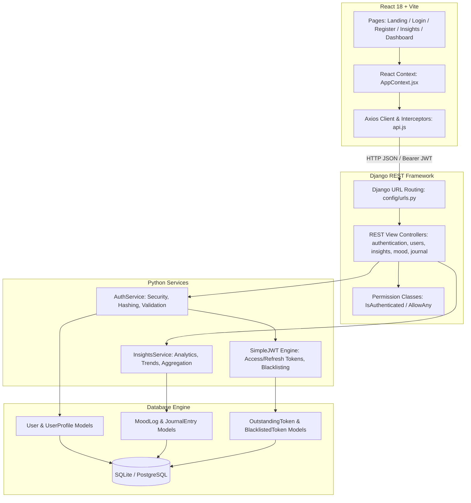
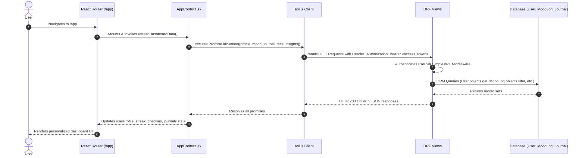
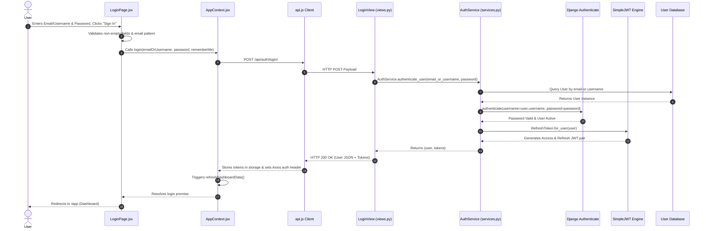
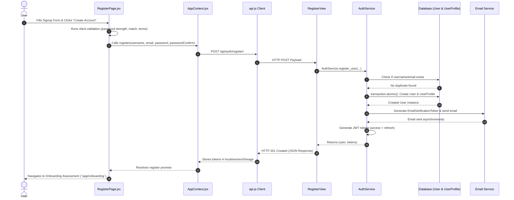
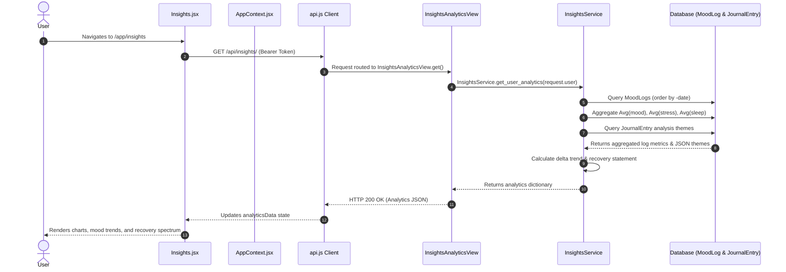
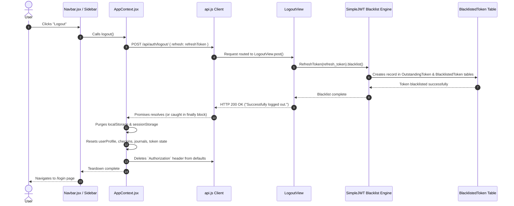

# MindCompass AI - Full End-to-End Architecture & Technical Notes

This document provides a comprehensive, production-grade technical breakdown of **MindCompass AI**, covering the full stack execution pipeline for five core features/pages:
1. **Home Page (Landing Page `/` & Workspace Dashboard `/app`)**
2. **Login Page (`/login`)**
3. **Signup / Register Page (`/register`)**
4. **Insight Page (`/app/insights`)**
5. **Logout Button & Session Teardown Flow**

It traces every feature across all system layers: **Frontend React Components**, **Context State Management**, **Axios HTTP Client / Interceptors**, **Django REST Framework (DRF) Routes & Views**, **Service Business Logic**, **JWT Security Engine**, and **Database ORM Models**.

---

## 1. System Architecture Overview



---

## 2. Home Page (Landing Page `/` & Workspace Dashboard `/app`)

### A. Feature Overview & Purpose
The Home experience consists of two distinct states:
1. **Landing Page (`/`)**: Public marketing interface introducing MindCompass AI features, interactive CTAs, testimonials, and navigation links to Auth pages.
2. **Workspace Dashboard (`/app`)**: Protected central hub for logged-in users, displaying real-time wellness metrics, check-in streak, daily AI recommendations, mood predictions, recent journal logs, and analytics summaries.

---

### B. Landing Page (`/`) Architecture

#### 1. Frontend UI Component (`Frontend/src/pages/LandingPage.jsx`)
- **Route**: `/` (Wrapped in `Layout` shell containing `Navbar.jsx` and `Footer.jsx`).
- **Access**: Public (`AllowAny`). Unauthenticated visitors view marketing content. Logged-in users see dynamic CTA buttons redirecting to `/app`.
- **UI Elements**:
  - Hero banner with headline, call-to-action button ("Start Your Journey").
  - Feature highlights grid (Mood Tracking, AI Journaling, Analytics Insights, Daily Guidance).
  - Responsive Navbar with theme toggle (Dark/Light) and Auth buttons (Login/Register).

---

### C. Workspace Dashboard (`/app`) Architecture

#### 1. Frontend UI Component (`Frontend/src/pages/Dashboard.jsx`)
- **Route**: `/app` (Wrapped in `AppLayout.jsx` containing Sidebar and Mobile Navigation).
- **Access**: Protected. Redirects unauthenticated users to `/login`.
- **UI State**:
  - `userProfile`: Display name, avatar, wellness score, check-in streak count.
  - `todayRecommendation`: Personalized AI wellness activity recommendation.
  - `predictionData`: AI-predicted mood trajectory for the day.
  - `checkins`: List of recent mood check-ins.
  - `journals`: Recent journal entries with emotion analysis tags.

#### 2. Context Data Hydration (`Frontend/src/context/AppContext.jsx`)
Upon mount or authentication, `AppContext` executes `refreshDashboardData()`, fetching all user data concurrently using `Promise.allSettled()` to prevent single-endpoint failures from blocking the entire UI:

```javascript
const refreshDashboardData = useCallback(async () => {
    const results = await Promise.allSettled([
        fetchUserProfile(),
        moodAPI.getHistory(),
        journalAPI.getAll(),
        activitiesAPI.getFeedback(),
        recommendationAPI.getToday(),
        aiAPI.getPrediction(),
        aiAPI.getInsights(),
        insightsAPI.getAnalytics()
    ]);
    // State setters update checkins, journals, recommendations, analytics...
}, [fetchUserProfile]);
```

---

### D. API Contracts & Endpoints

| Endpoint | Method | Auth | Description | Payload / Query |
| :--- | :--- | :--- | :--- | :--- |
| `/api/profile/?today=YYYY-MM-DD` | `GET` | Bearer Token | User profile & streak metrics | `today` date query string |
| `/api/mood/history/` | `GET` | Bearer Token | Mood logs history | None |
| `/api/journal/` | `GET` | Bearer Token | User journal entries | None |
| `/api/recommendation/today/` | `GET` | Bearer Token | Today's AI recommended activity | None |
| `/api/ai/prediction/` | `GET` | Bearer Token | Predicted mood for today | None |
| `/api/insights/` | `GET` | Bearer Token | Mood/Stress analytics summary | None |

---

### E. Backend Controllers & Views
- **`ProfileDetailView`** (`Backend/users/views.py`):
  - Fetches or initializes `UserProfile` for `request.user`. Calculates streak counter based on daily consecutive logs.
- **`TodayRecommendationView`** (`Backend/recommendation/views.py`):
  - Generates or retrieves daily activity recommendations using user risk profile and history.
- **`InsightsAnalyticsView`** (`Backend/insights/views.py`):
  - Computes 7-day average mood, stress, and sleep metrics.

---

### F. Sequence Diagram: Dashboard Data Hydration Flow



---

## 3. Login Page (`/login`)

### A. Feature Overview & Purpose
Allows existing users to authenticate securely using either their **Email** or **Username** combined with their **Password**, or via **Google OAuth**. Supports session persistence options (`rememberMe`), automatic JWT token storage, and redirection to `/app` or onboarding assessment.

---

### B. Frontend Layer (React.js)

#### 1. UI Component (`Frontend/src/pages/LoginPage.jsx`)
- **State Variables**:
  - `emailOrUsername`: Text input state for user login identifier.
  - `password`: Masked text input state for user password.
  - `rememberMe`: Boolean toggle (controls whether tokens store in `localStorage` or `sessionStorage`).
  - `error`: Form-level error string returned from API.
  - `fieldErrors`: Object mapping specific fields to validation error arrays.
  - `isLoading`: Submission button loading spinner indicator.
  - `showPassword`: Password visibility toggle toggle.

#### 2. Client-Side Validation (`handleSubmit`)
1. Checks for non-empty `emailOrUsername` and `password`.
2. Validates email format if `@` symbol is detected.
3. Sets `isLoading = true` and clears previous errors.
4. Invokes `login(emailOrUsername, password, rememberMe)` from `AppContext`.

---

### C. Context Action (`Frontend/src/context/AppContext.jsx`)

```javascript
const login = async (emailOrUsername, password, rememberMe = false) => {
    const response = await authAPI.login({
        email: emailOrUsername.includes('@') ? emailOrUsername : undefined,
        username: !emailOrUsername.includes('@') ? emailOrUsername : undefined,
        password
    });
    
    const { access, refresh } = response.data.tokens;
    const storage = rememberMe ? localStorage : sessionStorage;
    
    storage.setItem('access_token', access);
    storage.setItem('refresh_token', refresh);
    localStorage.setItem('currentUser', JSON.stringify(response.data.user));
    
    setToken(access);
    setRefreshToken(refresh);
    await refreshDashboardData();
    return response.data;
};
```

---

### D. API Contract

#### Request
- **URL**: `POST /api/auth/login/`
- **Headers**: `Content-Type: application/json`
- **Body**:
```json
{
  "email": "user@example.com",
  "password": "SecurePassword123!"
}
```

#### Response (HTTP 200 OK)
```json
{
  "success": true,
  "message": "Login successful.",
  "user": {
    "id": "c3a1b8e4-8f2a-4d3b-9a1c-2e4f6a8b0c2d",
    "username": "jatan_user",
    "email": "user@example.com",
    "profile": {
      "is_onboarded": true,
      "is_email_verified": true,
      "streak": 5,
      "wellness_score": 82
    }
  },
  "tokens": {
    "refresh": "eyJhbGciOiJIUzI1NiIsInR5cCI6IkpXVCJ9...",
    "access": "eyJhbGciOiJIUzI1NiIsInR5cCI6IkpXVCJ9..."
  }
}
```

---

### E. Backend Architecture (Django REST Framework)

#### 1. View Controller (`Backend/authentication/views.py` -> `LoginView`)
- **Permission**: `AllowAny`.
- **Execution Flow**:
  1. Extracts `email` / `username` and `password` from `request.data`.
  2. Invokes `AuthService.authenticate_user(email_or_username, password)`.
  3. On success: Serializes user with `UserSerializer` and returns HTTP 200 with tokens.
  4. On `ValidationError`: Passes error to `validation_error_response()` returning HTTP 400.

#### 2. Service Layer (`Backend/authentication/services.py` -> `AuthService.authenticate_user`)
1. **Input Sanitization**: Cleans input using `clean_input(email_or_username, lowercase=True)`.
2. **User Lookup**: Searches database for `User` by `email` or `username`.
3. **Password Verification**: Calls `django.contrib.auth.authenticate(username=user.username, password=password)` which hashes the input password using PBKDF2 / Argon2 and compares against stored hash.
4. **Account State Verification**: Ensures `user.is_active == True`.
5. **Token Generation**: Invokes `AuthService.generate_tokens_for_user(user)` using SimpleJWT's `RefreshToken.for_user(user)`.

---

### F. Sequence Diagram: Authentication Flow



---

## 4. Signup / Register Page (`/register`)

### A. Feature Overview & Purpose
Registers new user accounts, verifies password strength and confirmation matching, initializes a linked `UserProfile` database model, triggers an automated email verification link, and grants immediate JWT authentication tokens for seamless onboarding.

---

### B. Frontend Layer (React.js)

#### 1. UI Component (`Frontend/src/pages/RegisterPage.jsx`)
- **Form State**:
  - `username`: Requested unique username string.
  - `email`: User email address.
  - `password`: New password.
  - `passwordConfirm`: Password confirmation match.
  - `acceptTerms`: Checkbox boolean (must be `true` to submit).
  - `errors`: Specific field validation error state.
  - `isLoading`: Form submission loading state.

#### 2. Validation Rules (`validateForm`)
- **Username**: Must be 3-30 characters, alphanumeric with underscores/hyphens.
- **Email**: Must pass standard regex pattern (`^[^\s@]+@[^\s@]+\.[^\s@]+$`).
- **Password Strength**: Minimum 8 characters, must contain at least one uppercase letter, one lowercase letter, one digit, and one special character (`!@#$%^&*`).
- **Password Match**: `password === passwordConfirm`.
- **Terms**: Must check Terms of Service box.

---

### C. API Contract

#### Request
- **URL**: `POST /api/auth/register/`
- **Headers**: `Content-Type: application/json`
- **Body**:
```json
{
  "username": "jatan_dev",
  "email": "jatan@example.com",
  "password": "Password123!",
  "password_confirm": "Password123!"
}
```

#### Response (HTTP 201 Created)
```json
{
  "success": true,
  "message": "Registration successful. Please verify your email.",
  "user": {
    "id": "f47ac10b-58cc-4372-a567-0e02b2c3d4e5",
    "username": "jatan_dev",
    "email": "jatan@example.com",
    "profile": {
      "is_onboarded": false,
      "is_email_verified": false,
      "streak": 0,
      "wellness_score": null
    }
  },
  "tokens": {
    "refresh": "eyJhbGciOiJIUzI1NiIsInR5cCI6IkpXVCJ9...",
    "access": "eyJhbGciOiJIUzI1NiIsInR5cCI6IkpXVCJ9..."
  }
}
```

---

### D. Backend Architecture (Django REST Framework)

#### 1. View Controller (`Backend/authentication/views.py` -> `RegisterView`)
- **Permission**: `AllowAny`.
- Invokes `AuthService.register_user(...)`. Catch `ValidationError` to format field-specific error messages.

#### 2. Service Layer (`Backend/authentication/services.py` -> `AuthService.register_user`)
Executed within an atomic database transaction (`transaction.atomic()`):

```python
@classmethod
def register_user(cls, username, email, password, password_confirm=None):
    # 1. Clean and normalize inputs
    username = clean_input(username, lowercase=True)
    email = clean_input(email, lowercase=True)

    # 2. Format & Password Validations
    validate_username_format(username)
    validate_email_format(email)
    validate_password_strength(password, username, email)

    # 3. Uniqueness Check
    if User.objects.filter(username=username).exists():
        raise ValidationError({"username": ["A user with that username already exists."]})
    if User.objects.filter(email=email).exists():
        raise ValidationError({"email": ["A user with that email already exists."]})

    # 4. Atomic Database Creation
    user = User.objects.create_user(username=username, email=email, password=password)
    profile, _ = UserProfile.objects.get_or_create(user=user)
    profile.is_email_verified = False
    profile.save()

    # 5. Email Verification Dispatch
    cls.send_verification_email(user)

    # 6. Return User & Tokens
    tokens = cls.generate_tokens_for_user(user)
    return user, tokens
```

---

### E. Sequence Diagram: Registration Flow



---

## 5. Insight Page (`/app/insights`)

### A. Feature Overview & Purpose
The Insights Page provides deep analytics and telemetry on user mental health trends over time. It visualizes mood fluctuations, stress levels, sleep correlation, cognitive theme distributions extracted by AI NLP from journal entries, and dynamic recovery spectrum evidence statements.

---

### B. Frontend Layer (React.js)

#### 1. UI Component (`Frontend/src/pages/Insights.jsx`)
- **Access**: Protected workspace page (`/app/insights`).
- **State Management**:
  - `timeRange`: Active analytics filter (`'7d'`, `'30d'`, `'90d'`).
  - `analyticsData`: Backend analytics object holding summary averages and trends.
  - `insightsLoading`: Loading state indicator.
- **UI Sub-components & Visualizations**:
  - **Summary Metrics Grid**: Displays Average Mood score, Average Stress level, Average Sleep hours, and Trend status badge (`Improving Stability`, `Stable`, `Slight Decline`, `Significant Decline`).
  - **Recovery Spectrum Card**: Displays AI-calculated recovery evidence statement.
  - **Mood & Stress Trend Chart**: Line graph plotting date vs mood/stress ratings.
  - **Cognitive Themes Breakdown**: Bar chart or tag cluster showing recurring journal themes (e.g., *Work*, *Anxiety*, *Family*, *Gratitude*).

---

### C. API Contract

#### Request
- **URL**: `GET /api/insights/`
- **Headers**: `Authorization: Bearer <access_token>`

#### Response (HTTP 200 OK)
```json
{
  "summary": {
    "averageMood": 3.8,
    "averageStress": 4.2,
    "averageSleep": 7.5,
    "moodTrend": "Improving Stability"
  },
  "recoverySpectrum": "Your stress has reduced by 15% over the last two weeks.",
  "moodTrends": [
    { "date": "Mon", "mood": 3, "stress": 6, "sleep": 6.5, "productivity": 3 },
    { "date": "Tue", "mood": 4, "stress": 4, "sleep": 7.5, "productivity": 4 },
    { "date": "Wed", "mood": 4, "stress": 3, "sleep": 8.0, "productivity": 4 }
  ],
  "cognitiveThemes": [
    { "theme": "Work", "value": 5 },
    { "theme": "Mindfulness", "value": 3 }
  ]
}
```

---

### D. Backend Aggregation Engine (`Backend/insights/services.py` -> `InsightsService`)

```python
class InsightsService:
    @classmethod
    def get_user_analytics(cls, user):
        recent_moods = MoodLog.objects.filter(user=user).order_by('-date')[:7]
        if len(recent_moods) < 3:
            return {"insufficient_data": True}
            
        avg_mood = MoodLog.objects.filter(user=user).aggregate(Avg('mood'))['mood__avg'] or 3.0
        avg_stress = MoodLog.objects.filter(user=user).aggregate(Avg('stress'))['stress__avg'] or 5.0
        avg_sleep = MoodLog.objects.filter(user=user).aggregate(Avg('sleep'))['sleep__avg'] or 7.0
        
        # Historical Trend Calculation (Comparing recent 7 days vs prior 7 days)
        logs = list(MoodLog.objects.filter(user=user).order_by('-date')[:14])
        if len(logs) >= 4:
            mid = len(logs) // 2
            recent_avg = sum([m.mood for m in logs[:mid]]) / mid
            older_avg = sum([m.mood for m in logs[mid:]]) / (len(logs) - mid)
            delta = recent_avg - older_avg
            if delta > 0.5: trend = "Improving Stability"
            elif delta >= -0.1: trend = "Stable"
            elif delta > -0.6: trend = "Slight Decline"
            else: trend = "Significant Decline"
        else:
            trend = "Stable"

        # Theme Frequency Aggregation from Journal Analysis JSON
        recent_journals = JournalEntry.objects.filter(user=user)[:5]
        themes_map = {}
        for entry in recent_journals:
            themes = entry.analysis.get("themes", [])
            for theme in themes:
                themes_map[theme] = themes_map.get(theme, 0) + 1
        
        themes_data = [{"theme": k, "value": v} for k, v in themes_map.items()]

        return {
            "summary": {
                "averageMood": round(float(avg_mood), 1),
                "averageStress": round(float(avg_stress), 1),
                "averageSleep": round(float(avg_sleep), 1),
                "moodTrend": trend
            },
            "recoverySpectrum": recovery_statement,
            "moodTrends": daily_trends,
            "cognitiveThemes": themes_data
        }
```

---

### E. Sequence Diagram: Insights Analytics Pipeline



---

## 6. Logout Button & Session Teardown Flow

### A. Feature Overview & Purpose
Ensures complete server-side and client-side revocation of authenticated sessions when a user clicks "Log Out". Invalidates refresh tokens on the backend using **JWT Blacklisting**, purges all sensitive credentials from browser storage, resets global application state, and redirects the browser safely to `/login`.

---

### B. Frontend Implementation

#### 1. Component Trigger (`Navbar.jsx` / `AppLayout.jsx`)
Clicking the "Log Out" button triggers `handleLogout()`:

```javascript
const handleLogout = async () => {
    try {
        await logout();
    } finally {
        navigate('/login');
    }
};
```

#### 2. Context Teardown (`Frontend/src/context/AppContext.jsx`)

```javascript
const logout = async () => {
    try {
        if (refreshToken) {
            await authAPI.logout(refreshToken);
        }
    } catch (error) {
        console.warn('Backend logout call failed or token already expired:', error);
    } finally {
        // 1. Purge Browser Storage
        localStorage.removeItem('access_token');
        localStorage.removeItem('refresh_token');
        localStorage.removeItem('currentUser');
        sessionStorage.removeItem('access_token');
        sessionStorage.removeItem('refresh_token');

        // 2. Reset Context State Variables
        setToken(null);
        setRefreshToken(null);
        setUserProfile({ name: '', email: '', is_email_verified: false });
        setIsOnboarded(false);
        setCheckins([]);
        setJournals([]);
        setAnalyticsData(null);

        // 3. Clear Default Axios Authorization Header
        delete api.defaults.headers.common['Authorization'];
    }
};
```

---

### C. API Contract

#### Request
- **URL**: `POST /api/auth/logout/`
- **Headers**: `Content-Type: application/json`
- **Body**:
```json
{
  "refresh": "eyJhbGciOiJIUzI1NiIsInR5cCI6IkpXVCJ9..."
}
```

#### Response (HTTP 200 OK)
```json
{
  "success": true,
  "message": "Successfully logged out."
}
```

---

### D. Backend Token Revocation Engine (`Backend/authentication/views.py`)

```python
class LogoutView(APIView):
    permission_classes = [AllowAny]

    def post(self, request):
        refresh_token = request.data.get('refresh')
        if refresh_token:
            try:
                token = RefreshToken(refresh_token)
                token.blacklist()  # Writes to BlacklistedToken database table
            except Exception:
                pass  # Token was already blacklisted or expired

        return Response({
            "success": True,
            "message": "Successfully logged out."
        }, status=status.HTTP_200_OK)
```

---

### E. Automatic Session Expiration Interceptor (`Frontend/src/services/api.js`)
If an access token expires during a session and the refresh token is also invalid or blacklisted, the Axios response interceptor catches the HTTP 401 error, purges browser storage, and dispatches a global `auth_session_expired` event to force signout:

```javascript
api.interceptors.response.use(
    (response) => response,
    async (error) => {
        if (error.response && error.response.status === 401 && !originalRequest._retry) {
            originalRequest._retry = true;
            try {
                // Attempt silent refresh call
                const refreshRes = await axios.post(`${API_URL}/api/auth/refresh/`, { refresh });
                // Update tokens...
            } catch (refreshError) {
                // Refresh failed: purge tokens and dispatch expiration event
                localStorage.clear();
                sessionStorage.clear();
                window.dispatchEvent(new Event('auth_session_expired'));
            }
        }
        return Promise.reject(error);
    }
);
```

---

### F. Sequence Diagram: Logout & Revocation Flow



---

## 7. Comprehensive Database Schema Matrix

| Table Name | Model Class | Key Fields & Types | Constraints & Indexing | Description |
| :--- | :--- | :--- | :--- | :--- |
| `users_user` | `User` | `id` (UUID, PK)<br>`username` (varchar)<br>`email` (varchar)<br>`password` (varchar)<br>`google_id` (varchar) | `email`: Unique<br>`username`: Unique<br>`google_id`: Unique, Nullable | Extends `AbstractUser`. Primary identity model. |
| `users_userprofile` | `UserProfile` | `id` (UUID, PK)<br>`user_id` (FK -> User)<br>`streak` (integer)<br>`wellness_score` (integer)<br>`is_onboarded` (bool)<br>`is_email_verified` (bool) | `user`: OneToOneField (CASCADE)<br>Default `streak`: 0 | Holds extended user preferences, health telemetry, & metrics. |
| `authentication_emailverificationtoken` | `EmailVerificationToken` | `id` (UUID, PK)<br>`user_id` (FK -> User)<br>`token` (varchar)<br>`created_at` (datetime)<br>`expires_at` (datetime) | Unique token index | Manages email verification links & expiration timeouts. |
| `mood_moodlog` | `MoodLog` | `id` (UUID, PK)<br>`user_id` (FK -> User)<br>`mood` (int)<br>`stress` (int)<br>`sleep` (decimal)<br>`date` (date) | Index on `(user_id, date)` | Stores daily check-in telemetry (mood, stress, sleep). |
| `journal_journalentry` | `JournalEntry` | `id` (UUID, PK)<br>`user_id` (FK -> User)<br>`text` (text)<br>`analysis` (JSONB)<br>`is_voice` (bool)<br>`created_at` (datetime) | Index on `(user_id, created_at)` | Holds text/voice journal content and AI NLP output. |
| `token_blacklist_outstandingtoken` | `OutstandingToken` | `id` (BigInt, PK)<br>`token` (text)<br>`user_id` (FK -> User)<br>`created_at` (datetime)<br>`expires_at` (datetime) | Unique token hash index | Tracks all issued SimpleJWT refresh tokens. |
| `token_blacklist_blacklistedtoken` | `BlacklistedToken` | `id` (BigInt, PK)<br>`token_id` (OneToOne -> OutstandingToken)<br>`blacklisted_at` (datetime) | Foreign key constraint | Stores revoked refresh tokens to prevent reuse. |

---

## 8. Security Architecture & Edge Cases Summary

1. **Password Storage**: Passwords are hashed using Django's default PBKDF2 algorithm with SHA-256 (or Argon2), ensuring plaintext passwords are never stored or logged.
2. **JWT Lifecycle & Rotation**:
   - Short-lived **Access Tokens** (15-60 minute expiration) minimize risk if intercepted.
   - Long-lived **Refresh Tokens** (7-14 day expiration) allow seamless token renewal via `/api/auth/refresh/`.
   - Blacklisting ensures tokens become immediately invalid upon logout.
3. **Input Sanitization**: `clean_input()` prevents XSS and injection attacks by trimming whitespace and escaping dangerous characters before database insertion.
4. **Resilient Data Fetching**: `Promise.allSettled()` in `refreshDashboardData()` guarantees that API hiccups in non-critical components (e.g. AI prediction timeout) will not break page rendering for core features.
5. **Session Isolation**: `storage.removeItem()` combined with state reset guarantees zero data leakage between user sessions on shared browser devices.
