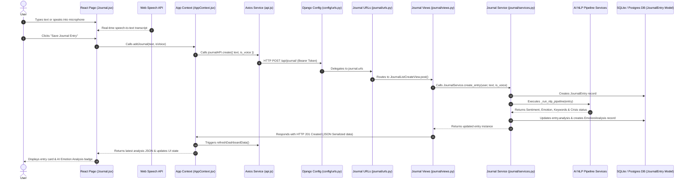

# Journal Feature: End-to-End Architecture & Technical Guide

This document provides a comprehensive, step-by-step technical explanation of the **Journal Feature** in Mind-Compass-AI. It traces the full data pipeline and lifecycle across all layers—from the **Frontend UI components** and **React Context** to **Axios HTTP clients**, **Django API routing**, **REST View Controllers**, **Service Layer**, **AI NLP Pipeline**, and **Database Models**.

---

## 1. High-Level Architecture Overview



---

## 2. Frontend Layer (React.js)

### A. UI Page Component (`Frontend/src/pages/Journal.jsx`)
The user-facing component handles state management, Web Speech API audio transcription, prompt selection, and user interactions.

#### State Variables
- `text`: Current text typed or transcribed in the journal text area.
- `isRecording`: Boolean indicating whether microphone speech recognition is currently active.
- `recordTime`: Timer tracking recording duration in seconds.
- `interimTranscript`: Real-time pending speech recognition transcript.
- `latestAnalysis`: Holds the newly returned AI NLP analysis (`sentiment`, `emotion`, `confidence`, `themes`, `crisisStatus`).
- `editingId`: ID of the entry currently being edited in inline mode.
- `editText`: Text input state when editing an existing entry.

#### Functions & Methods
1. **`toggleRecording()`**
   - **Purpose**: Initializes or halts browser-native speech recognition using `window.SpeechRecognition` or `window.webkitSpeechRecognition`.
   - **Behavior**: Sets continuous mode and interim results to `true`. On speech results (`onresult`), appends transcribed text to `text`. Starts a 1-second interval timer for recording duration. Handles microphone permission errors gracefully.

2. **`handlePromptClick(promptText)`**
   - **Purpose**: Appends pre-defined reflection prompts (e.g., *"What are you grateful for?"*) into the text editor area.

3. **`handleSubmit(e)`**
   - **Purpose**: Handles form submission for new journal entries.
   - **Execution Flow**:
     1. Prevents default form submission.
     2. Sets `isLoadingAnalysis = true`.
     3. Awaits `addJournal(text, isVoiceEntry)` from `AppContext`.
     4. Sets `latestAnalysis` to the returned analysis object and resets text input.

4. **`handleStartEdit(journal)` & `handleSaveEdit(journalId)`**
   - **Purpose**: Triggers inline editing mode and sends updated content to backend via `updateJournal(journalId, editText)`.

5. **`handleDeleteClick(journalId)`**
   - **Purpose**: Prompts confirmation modal and invokes `deleteJournal(journalId)`.

---

### B. Context & State Management (`Frontend/src/context/AppContext.jsx`)
Centralized state layer that interfaces between UI components and backend REST endpoints.

#### Functions & Methods
1. **`refreshDashboardData()`**
   - **Purpose**: Fetches all user data concurrently using `Promise.allSettled()`.
   - **Journal Action**: Invokes `journalAPI.getAll()`, transforms backend responses (`is_voice` -> `isVoice`), and updates central `journals` array state.

2. **`addJournal(text, isVoice)`**
   - **Payload**: `{ text: string, is_voice: boolean }`
   - **Execution**: Calls `journalAPI.create(payload)`, awaits server response, triggers `refreshDashboardData()`, and returns `response.data.analysis`.

3. **`updateJournal(id, text)`**
   - **Payload**: `{ text: string }`
   - **Execution**: Calls `journalAPI.update(id, payload)` and refreshes dashboard state.

4. **`deleteJournal(id)`**
   - **Execution**: Calls `journalAPI.delete(id)` and refreshes dashboard state.

---

### C. Axios API Service Layer (`Frontend/src/services/api.js`)
Configures HTTP communication with the Django backend server (`http://localhost:8000`).

#### Interceptors & Configuration
- **Base URL**: `VITE_API_URL` (default `http://localhost:8000`).
- **Request Interceptor**: Extracts JWT access token from `localStorage`/`sessionStorage` and attaches `Authorization: Bearer <access_token>` to every request header.
- **Response Interceptor**: Intercepts `401 Unauthorized` responses. Attempts automatic background token refresh via `/api/auth/refresh/`. If refresh succeeds, retries original request; if failed, triggers `auth_session_expired` event to securely log out user.

#### `journalAPI` Service Object
```javascript
export const journalAPI = {
    getAll: () => api.get('/api/journal/'),
    getById: (id) => api.get(`/api/journal/${id}/`),
    create: (data) => api.post('/api/journal/', data),
    update: (id, data) => api.put(`/api/journal/${id}/`, data),
    delete: (id) => api.delete(`/api/journal/${id}/`),
};
```

---

## 3. Backend Configuration & Routing Layer (Django)

### A. Root URL Router (`Backend/config/urls.py`)
Directs incoming HTTP requests under `/api/journal/` to the journal application module.

```python
urlpatterns = [
    ...
    path('api/journal/', include('journal.urls')),
    ...
]
```

### B. App URL Router (`Backend/journal/urls.py`)
Maps specific URL paths to class-based API Views.

```python
urlpatterns = [
    path('', JournalListCreateView.as_view(), name='journal_list_create'),
    path('<uuid:pk>/', JournalDetailView.as_view(), name='journal_detail'),
]
```

---

## 4. Backend View Controller Layer (`Backend/journal/views.py`)

Handles incoming HTTP requests, performs permission checks, invokes business logic services, and returns HTTP responses.

### Classes & Methods

#### 1. `JournalListCreateView(APIView)`
Requires authentication (`permission_classes = [IsAuthenticated]`).

- **`get(self, request)`**:
  - Fetches all entries for logged-in user via `JournalService.list_entries(request.user)`.
  - Serializes entries with `JournalEntrySerializer(entries, many=True)`.
  - Returns `HTTP 200 OK`.

- **`post(self, request)`**:
  - Validates request payload (`text` required).
  - Invokes `JournalService.create_entry(request.user, text, is_voice)`.
  - Calls `AIServicePipeline.run_pipeline_if_ready(request.user)` to update cross-feature wellness metrics.
  - Serializes new entry and returns `HTTP 201 CREATED`.

#### 2. `JournalDetailView(APIView)`
Handles single journal operations by primary key (`uuid:pk`).

- **`get(self, request, pk)`**: Fetches single entry or returns `HTTP 404 NOT FOUND`.
- **`put(self, request, pk)`**: Validates text, updates entry via `JournalService.update_entry()`, re-runs AI pipeline, and returns updated JSON (`HTTP 200 OK`).
- **`delete(self, request, pk)`**: Deletes entry via `JournalService.delete_entry()` and returns `HTTP 204 NO CONTENT`.

---

## 5. Backend Service & AI Pipeline Layer (`Backend/journal/services.py`)

Encapsulates core business rules, database queries, and AI Natural Language Processing (NLP) execution.

### Class: `JournalService`

#### Methods & Internal Pipeline

1. **`list_entries(user)`**
   - Returns queryset of `JournalEntry` records belonging strictly to the requesting user (`user=user`).

2. **`get_entry(user, entry_id)`**
   - Safely queries database for specific entry matching `id` and `user`. Returns `None` on `DoesNotExist`.

3. **`_run_nlp_pipeline(cls, entry)` (Core AI Intelligence)**
   - Executes live multi-stage NLP analysis on journal entry text content:
     1. **Sentiment Analysis** (`SentimentAnalysisService.analyze`): Computes polarity scores (VADER) to classify sentiment (Positive, Neutral, Negative).
     2. **Emotion Detection** (`EmotionDetectionService.detect`): Classifies primary and secondary emotions (Joy, Sadness, Anxiety, Anger, Fear, Contentment) and confidence score.
     3. **Keyword & Topic Extraction** (`KeywordExtractionService.extract`): Extracts key themes and topics.
     4. **Crisis Risk Detection** (`CrisisDetectionService.detect`): Checks text against risk indicators to compute `risk_level` (Safe, Needs Attention, Urgent Help Needed).
   - **Data Storage**:
     - Saves structured JSON result directly into `entry.analysis`:
       ```json
       {
         "sentiment": "Negative",
         "emotion": "Anxiety",
         "confidence": 0.94,
         "themes": ["Work Stress", "Fatigue"],
         "crisisStatus": "Safe"
       }
       ```
     - Persists record into relational `EmotionAnalysis` database table.

4. **`create_entry(cls, user, text, is_voice=False)`**
   - Instantiates `JournalEntry` DB object, executes `_run_nlp_pipeline(entry)`, and returns entry.

5. **`update_entry(cls, user, entry_id, text, is_voice=None)`**
   - Checks if text modified. If changed, updates text and re-executes `_run_nlp_pipeline(entry)`.

6. **`delete_entry(cls, user, entry_id)`**
   - Removes entry from database.

---

## 6. Backend Serializer & Database Model Layer

### A. Serializer (`Backend/journal/serializers.py`)
Converts complex Django Model instances into JSON formats for REST API transmission.

```python
class JournalEntrySerializer(serializers.ModelSerializer):
    class Meta:
        model = JournalEntry
        fields = ['id', 'user', 'date', 'text', 'is_voice', 'analysis', 'created_at', 'updated_at']
        read_only_fields = ['id', 'user', 'date', 'analysis', 'created_at', 'updated_at']
```

---

### B. Database Model (`Backend/journal/models.py`)
Defines database schema and field attributes for the `journal_entry` table in SQLite/Postgres.

```python
class JournalEntry(models.Model):
    id = models.UUIDField(primary_key=True, default=uuid.uuid4, editable=False)
    user = models.ForeignKey(settings.AUTH_USER_MODEL, on_delete=models.CASCADE, related_name='journal_entries')
    
    date = models.DateTimeField(auto_now_add=True)
    text = models.TextField(help_text="Journal entry text content (transcribed if voice entry)")
    is_voice = models.BooleanField(default=False, help_text="Designates if this entry was captured via voice recording.")
    
    # Store dynamic sentiment classification analysis
    analysis = models.JSONField(default=dict, blank=True, help_text="AI Analysis containing sentiment indicators and themes.")
    
    created_at = models.DateTimeField(auto_now_add=True)
    updated_at = models.DateTimeField(auto_now=True)

    objects = models.Manager()

    class Meta:
        ordering = ['-created_at']

    def __str__(self):
        snippet = self.text[:30] + "..." if len(self.text) > 30 else self.text
        return f"{self.user.username} - {self.created_at.strftime('%Y-%m-%d')} - '{snippet}'"
```

---

## 7. Summary Matrix of Journal System Components

| Layer | File Path | Key Class / Method | Responsibilities |
| :--- | :--- | :--- | :--- |
| **Frontend UI** | `Frontend/src/pages/Journal.jsx` | `Journal` component | Handles voice recording, user typing, prompts, form submissions, and UI state. |
| **Frontend Context** | `Frontend/src/context/AppContext.jsx` | `addJournal`, `refreshDashboardData` | Manages global application state and synchronizes API data with UI. |
| **Frontend API** | `Frontend/src/services/api.js` | `journalAPI` | Executes Axios HTTP requests with JWT Bearer tokens and handles token refresh. |
| **Django Config** | `Backend/config/urls.py` | `urlpatterns` | Routes `/api/journal/` requests to the `journal` app routing module. |
| **App Routing** | `Backend/journal/urls.py` | `urlpatterns` | Maps base `/` and `/<uuid:pk>/` endpoints to DRF Class-Based Views. |
| **REST Controller** | `Backend/journal/views.py` | `JournalListCreateView`, `JournalDetailView` | Handles HTTP GET, POST, PUT, DELETE requests and enforces JWT authentication. |
| **Service & AI** | `Backend/journal/services.py` | `JournalService._run_nlp_pipeline` | Coordinates DB creation, Sentiment analysis, Emotion mapping, and Crisis detection. |
| **Data Schema** | `Backend/journal/models.py` | `JournalEntry` | Defines database table structure with UUID keys, user foreign keys, and JSON analysis storage. |
