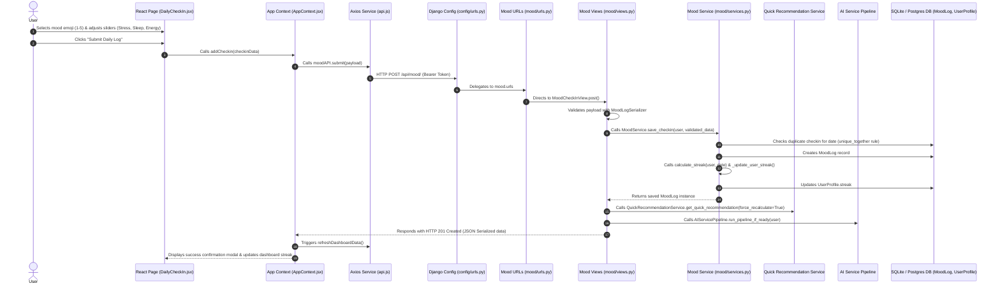

# Mood Check-in Feature: End-to-End Architecture & Technical Guide

This document provides a comprehensive, step-by-step technical explanation of the **Mood & Daily Check-in Feature** in Mind-Compass-AI. It traces the full data pipeline across all application layers—from the **Frontend UI components** and **React Context** to **Axios API Layer**, **Django Routing**, **REST View Controllers**, **Service Logic**, **Streak Calculation Engine**, **AI Pipeline Triggers**, and **Database Models**.

---

## 1. High-Level Architecture Overview



---

## 2. Frontend Layer (React.js)

### A. UI Page Component (`Frontend/src/pages/DailyCheckIn.jsx`)
The user interface where users log their daily psychological and lifestyle parameters.

#### Form State Variables
- `mood`: Numerical score ($1$ to $5$) selected via emoji button.
  - `1`: Down 😞
  - `2`: Neutral 😐
  - `3`: Good 🙂
  - `4`: Happy 😊
  - `5`: Excellent 🤩
- `stress`: Integer score ($0$ to $10$).
- `energy`: Integer score ($0$ to $10$).
- `sleep`: Decimal duration in hours (e.g. `7.5`).
- `productivity`: Integer score ($0$ to $10$).
- `social`: Integer score ($0$ to $10$).
- `notes`: Optional textual reflections.

#### Key Functions & Methods

1. **`getUTCDateString()`**
   - **Purpose**: Helper formatting current local time to ISO date string (`YYYY-MM-DD`) matching backend UTC `DateField` expectations.

2. **`useEffect(todaysCheckin)`**
   - **Execution**: Checks if a checkin entry for today already exists in central `checkins` state. If present, populates form fields with logged data and disables duplicate editing.

3. **`handleSubmit(e)`**
   - **Execution Flow**:
     1. Prevents default HTML form submit.
     2. Sets `isSubmitting = true`.
     3. Formats parameters into check-in payload and awaits `addCheckin()` from `AppContext`.
     4. On success, displays completion modal (`showSuccess = true`).

---

### B. Context & State Management (`Frontend/src/context/AppContext.jsx`)
Coordinates check-in submissions and central state updates.

#### Functions & Methods

1. **`addCheckin(checkinData)`**
   - **Payload**:
     ```json
     {
       "date": "2026-08-05",
       "mood": 4,
       "mood_label": "Happy",
       "stress": 3,
       "energy": 8,
       "sleep": 7.5,
       "productivity": 7,
       "social": 6,
       "notes": "Had a productive morning workout!"
     }
     ```
   - **Execution**: Calls `moodAPI.submit(payload)`, awaits response, triggers `refreshDashboardData()`, and returns `response.data`.

2. **`refreshDashboardData()`**
   - **Execution**: Invokes `moodAPI.getHistory()`. Maps raw API array fields (`sleep`, `mood_label`), reverses array order (oldest to newest), and sets `checkins` state.

---

### C. Axios API Service Layer (`Frontend/src/services/api.js`)

Provides endpoints for saving and retrieving mood history.

```javascript
export const moodAPI = {
    submit: (data) => api.post('/api/mood/', data),
    getHistory: () => api.get('/api/mood/history/'),
};
```

---

## 3. Backend Configuration & Routing Layer (Django)

### A. Root URL Router (`Backend/config/urls.py`)
Maps incoming requests with prefix `/api/mood/`:

```python
urlpatterns = [
    ...
    path('api/mood/', include('mood.urls')),
    ...
]
```

### B. App URL Router (`Backend/mood/urls.py`)
Routes request endpoints to REST view controllers:

```python
urlpatterns = [
    path('', MoodCheckInView.as_view(), name='mood_checkin'),
    path('history/', MoodHistoryView.as_view(), name='mood_history'),
]
```

---

## 4. Backend View Controller Layer (`Backend/mood/views.py`)

Handles authentication verification, data validation, service execution, and post-checkin AI triggers.

### Classes & Methods

#### 1. `MoodCheckInView(APIView)`
- `permission_classes = [IsAuthenticated]` (Requires valid JWT Bearer token).
- **`post(self, request)`**:
  - Validates request body using `MoodLogSerializer(data=request.data)`.
  - Calls `MoodService.save_checkin(request.user, serializer.validated_data)`.
  - **Immediate Quick Recommendation Trigger**: Invokes `QuickRecommendationService.get_quick_recommendation(request.user, force_recalculate=True)` to dynamically generate personalized activities.
  - **AI Pipeline Trigger**: Calls `AIServicePipeline.run_pipeline_if_ready(request.user)` to recalculate holistic wellness indices if journal entries are also present.
  - Returns `HTTP 201 CREATED`.

#### 2. `MoodHistoryView(APIView)`
- `permission_classes = [IsAuthenticated]`.
- **`get(self, request)`**: Retrieves historical check-in logs for requesting user via `MoodService.get_user_history(request.user)` and returns serialized JSON (`HTTP 200 OK`).

---

## 5. Backend Service & Streak Engine (`Backend/mood/services.py`)

Encapsulates database operations, duplicate checks, and dynamic consecutive streak calculations.

### Class: `MoodService`

#### Key Methods

1. **`get_user_history(cls, user)`**
   - Queries `MoodLog.objects.filter(user=user)`.

2. **`save_checkin(cls, user, validated_data)`**
   - Extracts target `date` (defaults to `timezone.localdate()`).
   - **Duplicate Guard**: Validates if `MoodLog.objects.filter(user=user, date=date).exists()`. Raises `ValidationError("You have already logged your mood for today.")` if duplicate detected.
   - Instantiates and saves `MoodLog` DB object.
   - Invokes `_update_user_streak(user, date)` to update streak count.

3. **`calculate_streak(cls, user, today=None)` (Streak Algorithm)**
   - Queries distinct checkin dates ordered descending (`-date`).
   - Verifies if most recent check-in is **today** or **yesterday**. If older, streak resets to `0`.
   - Iterates through distinct past dates to verify unbroken consecutive day sequences (`current_expected_date - 1 day`).
   - Returns calculated integer streak count.

4. **`_update_user_streak(cls, user, date)`**
   - Retrieves or creates `UserProfile` for user and updates `profile.streak` field.

---

## 6. Backend Serializer & Database Model Layer

### A. Database Model (`Backend/mood/models.py`)

Defines database structure and unique constraint throttle.

```python
class MoodLog(models.Model):
    id = models.UUIDField(primary_key=True, default=uuid.uuid4, editable=False)
    user = models.ForeignKey(settings.AUTH_USER_MODEL, on_delete=models.CASCADE, related_name='mood_logs')
    
    date = models.DateField(default=timezone.now)
    mood = models.IntegerField(help_text="Mood score from 1 (lowest) to 5 (highest)")
    mood_label = models.CharField(max_length=50) # Down, Neutral, Good, Happy, Excellent
    
    stress = models.IntegerField(help_text="Stress score from 0 (calm) to 10 (stressed)")
    energy = models.IntegerField(help_text="Energy and focus score from 0 to 10")
    sleep = models.DecimalField(max_digits=4, decimal_places=2, help_text="Sleeptime duration in hours")
    productivity = models.IntegerField(help_text="Productivity score from 0 to 10")
    social = models.IntegerField(help_text="Social connection score from 0 to 10")
    
    notes = models.TextField(blank=True, null=True, help_text="Optional daily notes")
    
    created_at = models.DateTimeField(auto_now_add=True)
    updated_at = models.DateTimeField(auto_now=True)

    objects = models.Manager()

    class Meta:
        ordering = ['-date', '-created_at']
        unique_together = ('user', 'date') # Throttle to max one log per day

    def __str__(self):
        return f"{self.user.username} - Mood {self.mood} on {self.date}"
```

---

### B. Serializer (`Backend/mood/serializers.py`)

Transforms model instances into JSON and enforces read-only field security.

```python
class MoodLogSerializer(serializers.ModelSerializer):
    class Meta:
        model = MoodLog
        fields = [
            'id', 'user', 'date', 'mood', 'mood_label', 
            'stress', 'energy', 'sleep', 'productivity', 
            'social', 'notes', 'created_at', 'updated_at'
        ]
        read_only_fields = ['id', 'user', 'created_at', 'updated_at']
```

---

## 7. Summary Matrix of Mood Check-in Components

| Layer | File Path | Key Class / Method | Responsibilities |
| :--- | :--- | :--- | :--- |
| **Frontend UI** | `Frontend/src/pages/DailyCheckIn.jsx` | `DailyCheckIn` component | Form UI for mood emoji selection, sliders (stress, sleep, energy), and submission. |
| **Frontend Context** | `Frontend/src/context/AppContext.jsx` | `addCheckin()` | Sends checkin payload, triggers dashboard data sync, and updates UI state. |
| **Frontend API** | `Frontend/src/services/api.js` | `moodAPI` | Executes Axios requests for submitting logs (`POST`) and fetching history (`GET`). |
| **Django Routing** | `Backend/config/urls.py` & `mood/urls.py` | `urlpatterns` | Routes `/api/mood/` and `/api/mood/history/` endpoints. |
| **REST Controller** | `Backend/mood/views.py` | `MoodCheckInView`, `MoodHistoryView` | Validates payloads, calls service layer, and triggers post-checkin AI recommendations. |
| **Service Logic** | `Backend/mood/services.py` | `MoodService.save_checkin`, `calculate_streak` | Prevents duplicate daily logs, creates `MoodLog`, and calculates consecutive active streaks. |
| **Data Schema** | `Backend/mood/models.py` | `MoodLog` | Defines schema with `unique_together = ('user', 'date')` DB constraint. |
