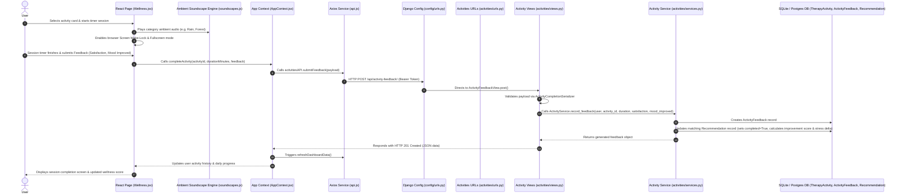

# Wellness & Therapy Activity Feature: End-to-End Architecture & Technical Guide

This document provides a comprehensive, step-by-step technical explanation of the **Wellness & Therapy Activity Feature** in Mind-Compass-AI. It details the complete data lifecycle—from the **Frontend UI components**, **Ambient Soundscape Engine**, and **Screen Wake-Lock Session Mode** to **React Context**, **Axios API Layer**, **Django Routing**, **REST View Controllers**, **Service Logic**, **Recommendation Feedback Loop**, and **Database Models**.

---

## 1. High-Level Architecture Overview



---

## 2. Frontend Layer (React.js)

### A. UI Page Component (`Frontend/src/pages/Wellness.jsx`)
The user-facing component manages activity browsing, category/difficulty filtering, interactive countdown timers, ambient soundscapes, fullscreen focus mode, and post-activity feedback collection.

#### Active View States
- `'list'`: Displays all available therapy activities grid, categories filter tabs, and AI Daily Recommendation banner.
- `'details'`: Displays full activity instructions, clinical purpose, scientific benefits, precautions, and interactive session timer.
- `'feedback'`: Post-session survey form collecting completion duration, satisfaction score (1–5 stars), and mood improvement assessment.

#### Key Functions & Methods

1. **`useEffect(fetchActivities)`**
   - **Execution**: On component mount, calls `activitiesAPI.getAll()`. Populates `activities` state array and dynamically extracts unique category filters.

2. **`enterFullscreen()` & `exitFullscreen()`**
   - **Purpose**: Implements browser Fullscreen API (`document.documentElement.requestFullscreen`) and Screen Wake Lock API (`navigator.wakeLock.request('screen')`).
   - **Benefit**: Ensures the device screen remains awake and distraction-free during meditation or breathing sessions.

3. **`handleStartSession()`**
   - **Execution**: Sets `isTimerRunning = true`, triggers `enterFullscreen()`, and initializes ambient audio background soundscape matching activity category via `audioEngine.play()`.

4. **`handleFinishSession()`**
   - **Execution**: Halts timer, stops ambient audio soundscape via `audioEngine.stop()`, releases screen wake lock, and transitions `activeView` to `'feedback'`.

5. **`handleSubmitFeedback(e)`**
   - **Purpose**: Form handler for session completion feedback.
   - **Execution**:
     1. Prevents default form submit.
     2. Calls `completeActivity(selectedActivity.id, durationMinutes, { satisfaction, moodImproved })` from `AppContext`.
     3. Resets view state to `'list'`.

---

### B. Context & State Management (`Frontend/src/context/AppContext.jsx`)
Centralized React Context state layer managing user completion history and dashboard synchronization.

#### Functions & Methods

1. **`completeActivity(activityId, durationMinutes, feedback)`**
   - **Payload**:
     ```json
     {
       "activity_id": "act-1",
       "duration_minutes": 10,
       "satisfaction": 5,
       "mood_improved": "Yes"
     }
     ```
   - **Execution**: Calls `activitiesAPI.submitFeedback(payload)`. Upon HTTP 201 response, awaits `refreshDashboardData()` to recalculate progress analytics and updates local `completedActivities` state.

2. **`refreshDashboardData()`**
   - **Activity Action**: Invokes `activitiesAPI.getFeedback()`. Maps backend response structure (`duration_minutes` -> `durationMinutes`, `mood_improved` -> `moodImproved`) into `completedActivities` state array.

---

### C. Axios API Service Layer (`Frontend/src/services/api.js`)

HTTP interface configured for wellness endpoints.

```javascript
export const activitiesAPI = {
    getAll: () => api.get('/api/activities/'),
    getById: (id) => api.get(`/api/activities/${id}/`),
    getFeedback: () => api.get('/api/activity-feedback/'),
    submitFeedback: (payload) => api.post('/api/activity-feedback/', payload),
};
```

---

## 3. Backend Configuration & Routing Layer (Django)

### A. Root URL Router (`Backend/config/urls.py`)
Routes wellness requests to respective application routers or view endpoints:

```python
urlpatterns = [
    ...
    path('api/activities/', include('activities.urls')),
    path('api/activity-feedback/', ActivityFeedbackView.as_view(), name='api_activity_feedback'),
    ...
]
```

### B. App URL Router (`Backend/activities/urls.py`)
Maps core activity catalog endpoints:

```python
urlpatterns = [
    path('', ActivityListView.as_view(), name='activity_list'),
    path('<str:pk>/', ActivityDetailView.as_view(), name='activity_detail'),
]
```

---

## 4. Backend View Controller Layer (`Backend/activities/views.py`)

Provides endpoints for fetching activity library details and recording activity execution feedback.

### Classes & Methods

#### 1. `ActivityListView(APIView)`
- `permission_classes = [AllowAny]` (Publicly accessible catalog).
- **`get(self, request)`**: Fetches all activities via `ActivityService.list_activities()` and returns serialized list (`HTTP 200 OK`).

#### 2. `ActivityDetailView(APIView)`
- `permission_classes = [AllowAny]`.
- **`get(self, request, pk)`**: Queries activity by slug ID (`pk`). Returns serialized data or `HTTP 404 NOT FOUND`.

#### 3. `ActivityFeedbackView(APIView)`
- `permission_classes = [IsAuthenticated]`.
- **`get(self, request)`**: Returns all historical feedback entries logged by requesting user via `ActivityService.list_user_feedbacks(request.user)`.
- **`post(self, request)`**:
  - Extracts `activity_id`, `duration_minutes`, `satisfaction`, and `mood_improved`.
  - Validates request structure using `ActivityCompletionSerializer`.
  - Invokes `ActivityService.record_feedback()`.
  - Returns created feedback object (`HTTP 201 CREATED`).

---

## 5. Backend Service & Recommendation Feedback Loop (`Backend/activities/services.py`)

Handles validation, feedback storage, and closed-loop AI Recommendation updates.

### Class: `ActivityService`

#### Key Methods

1. **`list_activities()`**: Returns `TherapyActivity.objects.all()`.
2. **`get_activity(activity_id)`**: Returns single `TherapyActivity` instance or `None`.
3. **`list_user_feedbacks(user)`**: Returns `ActivityFeedback` queryset filtered by user, ordered by date descending.

4. **`record_feedback(user, activity_id, duration_minutes, satisfaction, mood_improved)` (Core Feedback Loop)**:
   - **Daily Throttling Check**: Validates `ActivityFeedback.objects.filter(user=user, activity=activity, date=today)` to prevent multiple duplicate feedback submissions on the same day.
   - **Feedback Persistence**: Creates new `ActivityFeedback` instance.
   - **Closed-Loop AI Recommendation Update**:
     - Searches for recent uncompleted `Recommendation` records matching `(user, activity)` created within the last 2 days.
     - If found:
       1. Marks `rec.completed = True`.
       2. Sets `rec.user_rating = satisfaction`.
       3. Calculates `improvement_score`:
          - `"Yes"` $\rightarrow$ `improvement_score = 2.0`, `mood_after = mood + 1`.
          - `"A Little"` $\rightarrow$ `improvement_score = 1.0`, `mood_after = mood`.
          - `"No"` $\rightarrow$ `improvement_score = 0.0`, `mood_after = mood - 1`.
       4. Computes stress delta string (e.g., `"Stress Improved: 7 → 4"`) and saves `rec.save()`.

---

## 6. Backend Serializer & Database Model Layer

### A. Database Models (`Backend/activities/models.py`)

#### 1. `TherapyActivity`
- `id`: Slug primary key (e.g., `'act-1'`).
- `title`: Activity name (e.g., *"Box Breathing for Acute Anxiety"*).
- `category`: Category string (e.g., *Mindfulness*, *Breathing*, *Somatic*).
- `duration`: Expected duration string (e.g., *"5 min"*).
- `difficulty`: Level string (*Simple*, *Moderate*).
- `description`: Comprehensive markdown text containing clinical details.
- `instructions`: `JSONField` array of step-by-step instructions.

#### 2. `ActivityFeedback`
- `id`: UUID primary key.
- `user`: `ForeignKey` referencing user account.
- `activity`: `ForeignKey` referencing `TherapyActivity`.
- `date`: `DateField` auto-populated on creation.
- `duration_minutes`: Actual minutes user engaged in exercise.
- `satisfaction`: Rating score (1 to 5 stars).
- `mood_improved`: Text rating (*"Yes"*, *"A Little"*, *"No"*).

---

### B. Serializers (`Backend/activities/serializers.py`)

#### 1. `TherapyActivitySerializer`
Converts raw Markdown descriptions into structured fields using regex helper `_parse_field()`:
- `short_description`: Extracts overview text before markdown line divider `---`.
- `clinical_purpose`: Parses `**Clinical Purpose:**`.
- `scientific_benefits`: Parses `**Scientific Benefits:**`.
- `precautions`: Parses `**Contraindications/Precautions:**`.
- `equipment`, `setting`, `format`, `evidence_level`, `suitable_moods`, `suitable_conditions`.

#### 2. `ActivityCompletionSerializer`
Input validation serializer enforcing data rules:
- `duration_minutes`: Integer $\ge 1$.
- `satisfaction`: Integer between $1$ and $5$.
- `mood_improved`: Character string.

---

## 7. Summary Matrix of Wellness System Components

| Layer | File Path | Key Class / Method | Responsibilities |
| :--- | :--- | :--- | :--- |
| **Frontend UI** | `Frontend/src/pages/Wellness.jsx` | `Wellness` component | Activity catalog display, ambient soundscapes, timer focus mode, and feedback UI. |
| **Sound Engine** | `Frontend/src/utils/soundscapes.js` | `audioEngine` | Synthesizes and plays ambient Web Audio soundscapes for meditation and focus. |
| **Frontend Context** | `Frontend/src/context/AppContext.jsx` | `completeActivity()` | Dispatches completion payload to server and triggers dashboard data sync. |
| **Frontend API** | `Frontend/src/services/api.js` | `activitiesAPI` | Handles HTTP GET activity list and POST feedback submissions. |
| **Django Routing** | `Backend/config/urls.py` & `activities/urls.py` | `urlpatterns` | Routes `/api/activities/` and `/api/activity-feedback/` requests. |
| **REST Controller** | `Backend/activities/views.py` | `ActivityListView`, `ActivityFeedbackView` | Serves activity catalog and validates incoming completion feedback payloads. |
| **Service Logic** | `Backend/activities/services.py` | `ActivityService.record_feedback()` | Saves feedback record and updates linked AI Recommendation metrics closed-loop. |
| **Data Schema** | `Backend/activities/models.py` | `TherapyActivity`, `ActivityFeedback` | Defines catalog entries, user completion logs, and relational foreign keys. |
| **Parsing Serializer**| `Backend/activities/serializers.py` | `TherapyActivitySerializer` | Extracts structured clinical metadata from raw markdown activity descriptions. |
