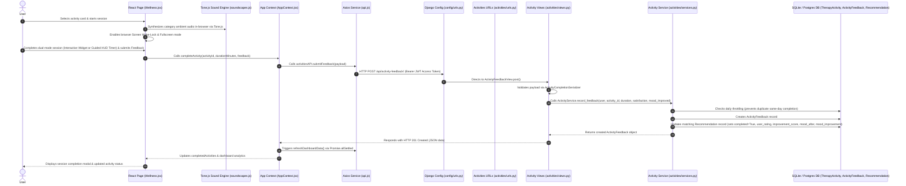

# Wellness & Therapy Activity Feature: End-to-End Architecture & Technical Guide

This document details the technical architecture and end-to-end data lifecycle of the **Wellness & Therapy Activity Feature** in Mind-Compass-AI. It covers all components—from the **Frontend UI pages**, **Tone.js Ambient Sound Engine**, **Screen Wake-Lock & Fullscreen Mode**, **Interactive Widgets**, **React Context State**, **Axios API Layer**, **Django URL Routing**, **REST View Controllers**, **Service Logic**, **AI Recommendation Feedback Loop**, to **Database Models and Serializers**.

---

## 1. High-Level Architecture Overview



---

## 2. Frontend Layer (React.js)

### A. UI Page Component (`Frontend/src/pages/Wellness.jsx`)
The primary user-facing component manages activity browsing, category/difficulty/duration filtering, title search, interactive widgets, guided HUD circle timers, Tone.js ambient audio playback, fullscreen focus mode, and post-activity feedback collection.

#### Active View States
- `'list'`: Displays activity library grid, category filter tabs (15 categories), difficulty filter (`Beginner`, `Intermediate`, `Advanced`), duration filter (`< 5 min`, `5-10 min`, `> 10 min`), title search input, and Today's AI Recommendation banner.
- `'details'`: Displays active session player with Mode Switcher (`interactive` vs `timer`), ambient soundscape player (`AmbientMusicPlayer`), 12 category-specific interactive widgets OR guided HUD circle timer, clinical metadata (purpose, scientific benefits, precautions, evidence level), and step-by-step instructions.
- `'feedback'`: Post-session survey form collecting star rating (1–5 stars), mood improvement assessment (`'Yes'`, `'A Little'`, `'No Change'`), optional text comment, back-to-session button, and close modal control.

#### Session Experience Modes
- `'interactive'`: Renders a category-matched interactive component:
  - `BreathingPacer` (Breathing)
  - `GroundingWizard` (Grounding)
  - `BodyStretchGuide` (Physical Activity)
  - `CognitiveShuffle` (Sleep Hygiene)
  - `WorryShredder` (Journaling / Shred activities)
  - `GratitudeConstellation` (Gratitude)
  - `ThoughtCourtScale` (Anxiety Relief)
  - `ZenRiverThoughts` (Mindfulness)
  - `STOPBrakePedal` (Emotional Regulation)
  - `FarFocusTargetChaser` (Digital Wellbeing)
  - `ZenCountingStreak` (Cognitive Exercises)
  - `BubblePopDeStresser` (Fallback for unmapped categories)
- `'timer'`: Renders a guided HUD circle timer with real-time digital readout, pause/resume, reset, and skip controls.

#### Key Functions & Methods
1. **`useEffect(fetchActivities)`**: On component mount, invokes `activitiesAPI.getAll()` to load the activity catalog into `activities` state array.
2. **`enterFullscreen()` & `exitFullscreen()`**: Requests browser Fullscreen API (`document.documentElement.requestFullscreen`) and Screen Wake Lock API (`navigator.wakeLock.request('screen')`) to keep screen awake during sessions.
3. **`startTimer(activity)`**: Initializes timer duration, sets `isTimerRunning = true`, switches `activeView` to `'details'`, and invokes `enterFullscreen()`.
4. **`handleTimerPause()`**, **`handleTimerReset()`**, **`handleSkipTimer()`**: Controls session timer state, pauses/resumes/restarts `audioEngine`, releases screen wake lock, exits fullscreen, and transitions `activeView` to `'feedback'`.
5. **`handleFeedbackSubmit(e)`**: Form handler for session completion feedback. Invokes `completeActivity(selectedActivity.id, durationMinutes, { satisfaction, moodImproved, comment })` from `AppContext` and resets view state to `'list'`.

---

### B. In-Browser Ambient Sound Engine (`Frontend/src/utils/soundscapes.js`)
Synthesizes professional ambient soundscapes entirely in-browser using **Tone.js** (Web Audio API) without requiring external audio files.

#### Class: `CategorySoundEngine` (`audioEngine`)
- **Tone.js Nodes**: Utilizes synths, noise generators (pink, brown, white noise), lowpass/highpass/bandpass filters, LFOs, metal synths, poly synths, AM synths, and reverbs.
- **Soundscape Registry (`CATEGORY_SOUNDSCAPES`)**: Provides 15 category-tailored ambient soundscapes:
  - `Breathing`: Peaceful Pink Noise Breath Swell (4 s in / 4 s out LFO)
  - `Meditation`: Deep Tibetan Singing Bowls (stuck every 8 s)
  - `Mindfulness`: Forest Stream & Chimes (brown noise stream + random chime drops)
  - `Sleep Hygiene`: Soft Rain & Ocean Waves (pink noise rain + brown noise wave LFO)
  - `Gratitude`: Warm Piano Arpeggios (C pentatonic scale)
  - `Journaling`: Cozy Rain & Soft Warmth (bandpass rain + warm AM chord hum)
  - `Physical Activity`: Kalimba Pulse (acoustic kalimba plucks + low pad)
  - `Relaxation`: Deep Ocean Swells (10 s lowpass wave cycle)
  - `Grounding`: Forest Wind & Low Earth Drone (G1 sine drone + wind LFO)
  - `Stress Management`: 528 Hz Healing Bell (solfeggio bell struck every 6 s)
  - `Anxiety Relief`: Crystal Glass Chimes (random crystal chime drops + white noise breeze)
  - `Emotional Regulation`: Water Drops & String Pad (E3 string pad + water drops)
  - `Digital Wellbeing`: Zen Bamboo Fountain (brown noise knock + water drop)
  - `Social Wellness`: Campfire Crackle & Evening Warmth (C3-E3-G3 pad + random crackle pops)
  - `Cognitive Exercises`: 40 Hz Gamma Focus Pulse (40 Hz AM-modulated tone for neural focus)

#### Audio Engine Methods
- `play(soundscape, durationSeconds)`: Initializes Tone.js AudioContext, creates master volume node, and starts synthesis routing.
- `pause()` & `resume()`: Suspends/resumes `Tone.Transport` and ramps master volume.
- `stop()`: Halts timers, cancels scheduled events, disposes audio nodes, and resets engine state.
- `restart(soundscape, durationSeconds)`: Stops active synthesis, resets `Tone.Transport` position to zero, and begins new playback session.
- `setVolume(val)` & `setMuted(muted)`: Dynamically adjusts master gain in decibels.

---

### C. Context & State Management (`Frontend/src/context/AppContext.jsx`)
Centralized React Context state layer managing user completion history, authentication session, and dashboard synchronization.

#### Key Functions & Methods
1. **`completeActivity(activityId, durationMinutes, feedback)`**
   - Dispatches payload to backend:
     ```json
     {
       "activity_id": "act-1",
       "duration_minutes": 10,
       "satisfaction": 5,
       "mood_improved": "Yes"
     }
     ```
   - Upon HTTP 201 response, awaits `refreshDashboardData()` to recalculate progress analytics and update local `completedActivities` state.
2. **`refreshDashboardData()`**
   - Concurrently fetches all user data using `Promise.allSettled` across endpoints: User Profile, Mood Check-ins, Journals, Activity Feedback (`activitiesAPI.getFeedback()`), AI Recommendation (`recommendationAPI.getToday()`), AI Prediction, AI Insights, and Analytics.
   - Maps backend feedback fields (`duration_minutes` $\rightarrow$ `durationMinutes`, `mood_improved` $\rightarrow$ `moodImproved`) into `completedActivities` state array.

---

### D. Axios API Service Layer (`Frontend/src/services/api.js`)

HTTP client configured with request/response interceptors for JWT Bearer token injection and automatic 401 token refreshing via `/api/auth/refresh/`.

```javascript
export const activitiesAPI = {
    getAll: () => api.get('/api/activities/'),
    getById: (id) => api.get(`/api/activities/${id}/`),
    getFeedback: () => api.get('/api/activity-feedback/'),
    submitFeedback: (payload) => api.post('/api/activity-feedback/', payload),
};
```

---

## 3. Backend Configuration & Routing Layer (Django)

### A. Root URL Router (`Backend/config/urls.py`)
Routes wellness activity requests to app-level URL configurations or view controllers:

```python
urlpatterns = [
    ...
    path('api/activities/', include('activities.urls')),
    path('api/activity-feedback/', ActivityFeedbackView.as_view(), name='api_activity_feedback'),
    ...
]
```

### B. App URL Router (`Backend/activities/urls.py`)
Maps catalog listing and detail view endpoints:

```python
urlpatterns = [
    path('', ActivityListView.as_view(), name='activity_list'),
    path('<str:pk>/', ActivityDetailView.as_view(), name='activity_detail'),
]
```

---

## 4. Backend View Controller Layer (`Backend/activities/views.py`)

Provides REST endpoints for retrieving activity library items and recording user completion feedback.

### Classes & Methods

#### 1. `ActivityListView(APIView)`
- `permission_classes = [AllowAny]` (Publicly accessible catalog).
- **`get(self, request)`**: Invokes `ActivityService.list_activities()` and returns serialized list (`HTTP 200 OK`).

#### 2. `ActivityDetailView(APIView)`
- `permission_classes = [AllowAny]`.
- **`get(self, request, pk)`**: Queries activity by slug primary key (`pk`). Returns serialized object or `HTTP 404 NOT FOUND`.

#### 3. `ActivityFeedbackView(APIView)`
- `permission_classes = [IsAuthenticated]`.
- **`get(self, request)`**: Returns historical feedback entries logged by the requesting user via `ActivityService.list_user_feedbacks(request.user)`.
- **`post(self, request)`**:
  - Extracts `activity_id`, `duration_minutes`, `satisfaction`, and `mood_improved`.
  - Validates input structure using `ActivityCompletionSerializer`.
  - Invokes `ActivityService.record_feedback()`.
  - Returns created feedback object (`HTTP 201 CREATED`).

---

## 5. Backend Service & Closed-Loop AI Recommendation Update (`Backend/activities/services.py`)

Handles completion validation, feedback storage, daily throttling, and closed-loop AI Recommendation updates.

### Class: `ActivityService`

#### Key Methods

1. **`list_activities()`**: Returns `TherapyActivity.objects.all()`.
2. **`get_activity(activity_id)`**: Returns single `TherapyActivity` instance or `None`.
3. **`list_user_feedbacks(user)`**: Returns `ActivityFeedback` queryset filtered by requesting user, ordered by date and creation time descending (`-date`, `-created_at`).

4. **`record_feedback(user, activity_id, duration_minutes, satisfaction, mood_improved)` (Core Closed-Loop Execution)**:
   - **Daily Throttling Check**: Checks `ActivityFeedback.objects.filter(user=user, activity=activity, date=today).exists()`. If true, raises `ValidationError("You have already completed this activity today.")`.
   - **Feedback Persistence**: Creates new `ActivityFeedback` DB record.
   - **Closed-Loop AI Recommendation Update**:
     - Queries recent uncompleted `Recommendation` records matching `(user, activity)` created within the last 2 days (`created_at__date__gte=today - timedelta(days=2)`).
     - If matching recommendation exists:
       1. Marks `rec.completed = True`.
       2. Sets `rec.user_rating = satisfaction`.
       3. Calculates `improvement_score` and `mood_after`:
          - `"Yes"` $\rightarrow$ `improvement_score = 2.0`, `mood_after = min(5, mood_val + 1)`.
          - `"A Little"` $\rightarrow$ `improvement_score = 1.0`, `mood_after = min(5, mood_val)`.
          - Else (`"No Change"` / `"No"`) $\rightarrow$ `improvement_score = 0.0`, `mood_after = max(1, mood_val - 1)`.
       4. Computes `rec.mood_improvement` string:
          - If `rec.stress` is present: calculates `stress_after` (for score $\ge 2.0$, stress $-3$; for score $\ge 1.0$, stress $-1$; else stress unchanged), resulting in string e.g. `"Stress Improved: 7 → 4"`.
          - Else if `rec.mood_before` and `rec.mood_after` are present: resulting in string e.g. `"Mood Improved: 3 → 4"`.
          - Else: `"No change"`.
       5. Saves `rec.save()`.

---

## 6. Backend Serializer & Database Model Layer

### A. Database Models (`Backend/activities/models.py`)

#### 1. `TherapyActivity`
- `id`: `CharField` primary key (e.g., `'act-1'`) matching static slug constants.
- `title`: Activity title string (e.g., *"Box Breathing for Acute Anxiety"*).
- `category`: Category string (e.g., *Breathing*, *Mindfulness*, *Grounding*).
- `duration`: Duration label string (e.g., *"5 min"*, *"10 min"*).
- `difficulty`: Difficulty level string (*Beginner*, *Intermediate*, *Advanced*).
- `description`: Comprehensive text containing markdown structured sections.
- `instructions`: `JSONField` step-by-step array of instructions.
- `created_at`, `updated_at`: `DateTimeField` audit timestamps.

#### 2. `ActivityFeedback`
- `id`: `UUIDField` primary key (`uuid.uuid4`).
- `user`: `ForeignKey` referencing `AUTH_USER_MODEL` (`related_name='activity_feedbacks'`).
- `activity`: `ForeignKey` referencing `TherapyActivity` (`related_name='feedbacks'`).
- `date`: `DateField` auto-populated on creation.
- `duration_minutes`: `IntegerField` representing actual completion time in minutes.
- `satisfaction`: `IntegerField` rating score from 1 to 5.
- `mood_improved`: `CharField` text rating (*"Yes"*, *"A Little"*, *"No Change"*).
- `created_at`, `updated_at`: `DateTimeField` audit timestamps.

---

### B. Serializers (`Backend/activities/serializers.py`)

#### 1. `TherapyActivitySerializer`
Parses raw Markdown descriptions into structured API fields using regex helper `_parse_field(obj, field_name)`:
- `short_description`: Extracts overview text prior to Markdown divider `---`.
- `clinical_purpose`: Parses `**Clinical Purpose:**`.
- `scientific_benefits`: Parses `**Scientific Benefits:**`.
- `precautions`: Parses `**Contraindications/Precautions:**`.
- `equipment`: Parses `**Equipment Required:**`.
- `setting`: Parses `**Setting:**`.
- `format`: Parses `**Format:**`.
- `evidence_level`: Parses `**Evidence Level:**`.
- `suitable_moods`: Parses `**Suitable Moods:**`.
- `suitable_conditions`: Parses `**Suitable Mental Health Conditions:**`.

#### 2. `ActivityFeedbackSerializer`
Standard `ModelSerializer` for returning `ActivityFeedback` instances (`id`, `user`, `activity`, `date`, `duration_minutes`, `satisfaction`, `mood_improved`, `created_at`, `updated_at`).

#### 3. `ActivityCompletionSerializer`
Input validation serializer enforcing data types and bounds:
- `duration_minutes`: `IntegerField(min_value=1)`.
- `satisfaction`: `IntegerField(min_value=1, max_value=5)`.
- `mood_improved`: `CharField(max_length=50)`.

---

## 7. Summary Matrix of Wellness System Components

| Layer | File Path | Key Class / Method | Responsibilities |
| :--- | :--- | :--- | :--- |
| **Frontend UI** | `Frontend/src/pages/Wellness.jsx` | `Wellness` component | Activity catalog display, filtering/search, dual-mode session player, fullscreen wake lock, and feedback collection. |
| **Sound Engine** | `Frontend/src/utils/soundscapes.js` | `CategorySoundEngine` (`audioEngine`) | Synthesizes in-browser Tone.js ambient soundscapes across 15 wellness categories. |
| **Sound Player UI** | `Frontend/src/components/AmbientMusicPlayer.jsx` | `AmbientMusicPlayer` component | Renders ambient soundscape control bar during active activity sessions. |
| **Interactive Widgets**| `Frontend/src/components/wellness/*` | Category Widget components | Interactive guided activities (`BreathingPacer`, `GroundingWizard`, `WorryShredder`, etc.). |
| **Frontend Context** | `Frontend/src/context/AppContext.jsx` | `completeActivity()`, `refreshDashboardData()` | Submits feedback payload to server and synchronizes dashboard state via `Promise.allSettled`. |
| **Frontend API** | `Frontend/src/services/api.js` | `activitiesAPI` | Handles HTTP requests for listing activities and submitting completion feedback. |
| **Django Routing** | `Backend/config/urls.py` & `activities/urls.py` | `urlpatterns` | Routes `/api/activities/` and `/api/activity-feedback/` endpoints. |
| **REST Controller** | `Backend/activities/views.py` | `ActivityListView`, `ActivityDetailView`, `ActivityFeedbackView` | Serves activity catalog and handles feedback GET/POST requests. |
| **Service Logic** | `Backend/activities/services.py` | `ActivityService.record_feedback()` | Enforces daily completion throttling, saves feedback, and updates linked AI Recommendations closed-loop. |
| **Data Models** | `Backend/activities/models.py` | `TherapyActivity`, `ActivityFeedback` | Defines DB schemas for static catalog entries and user completion logs. |
| **Serializers** | `Backend/activities/serializers.py` | `TherapyActivitySerializer`, `ActivityCompletionSerializer` | Extracts structured clinical fields from markdown descriptions and validates feedback payloads. |
